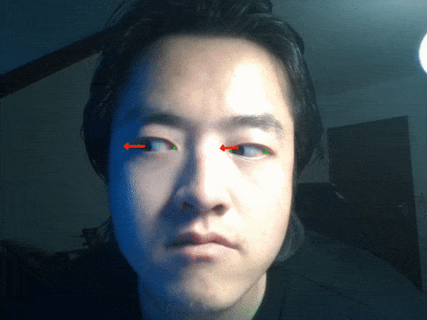

# HRNetGaze_torch

A brand-new feature-based gaze estimation model for high resolution images.

A light-weight HRNet to estimate landmarks of eye image. https://github.com/leoxiaobin/deep-high-resolution-net.pytorch

A frame-net to estimate gaze from frame image.

## Requirement

```
pytorch (cuda)
tensorboard
numpy
opencv
imutils
dlib
yacs
```

## Example




## Webcam Demo

```
python demo_webcam.py
```

dlib models: https://github.com/davisking/dlib-models

I use dlib mmod_human_face_detector to detect face region.

Then, i use dlib shape_predictor_5_landmarks to get eye landmarks for clippling eye region.

After that, i use my HRNFrameGaze model to estimate gaze.

reference:
https://arxiv.org/abs/1805.04771v1
